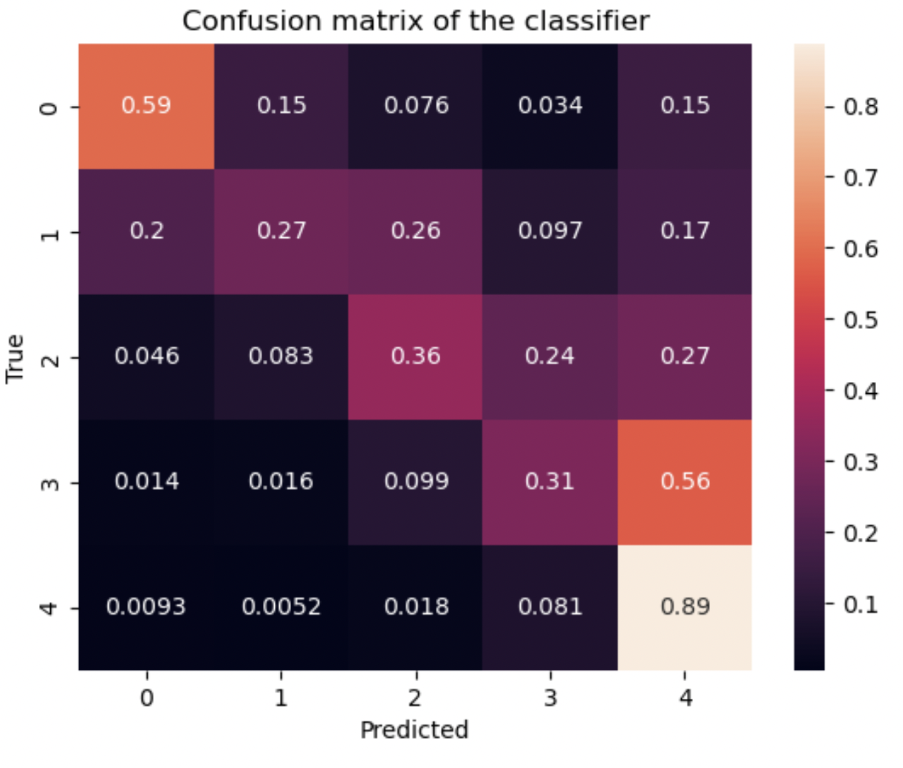

## CS506 Midterm Writeup
### Introduction
The goal of this project is to predict star ratings for Amazon movie reviews based on user review ID and some additional information associated to the user review ID. In this report, I will analyze the final model implemented, including techniques that contributed to performance improvements, and key insights gathered throughout the model creating process.
### Dataset and data preprocessing
The training dataset consists of 1,697,533 rows of unique reviews and 9 columns. Since the training dataset contains rows without the star rating, I divided them into a train set and a test set. The train set are rows from the training dataset that include values from the 'Score', 'Text', and 'Summary' column and the test set are rows without 'Score'. 

To handle missing values in the test set, I filled missing 'Summary' values with an empty string. This allowed for consistent vectorization of text data and prevented issues during preprocessing.
#### Text vectorization
To extract information from the 'Text' and 'Summary', I used TfidfVectorizer from the scikit-learn library, which is a natural language processing technique for determining the relavancy of each word to the review. The vectorization transform the text data ('Text' and 'Summary') into numerical features by calculating term frequency-inverse document frequency (TF-IDF) values. 

I vectorize both fields separately and then combine the vectorized result using hstack from scipy.sparse. This approach kept the combined matrix in sparse format, which allowed for efficient processing of high-dimensional data without exceeding memory limits compared to np.hstack. By vectorizing the 'Text' and 'Summary' fields separately, the model could leverage both the detailed review and its brief summary. This approach provided the model with a richer context to interpret user sentiments before combining them for a unified representation.

I initially attempted to merge 'Text' and 'Summary' into one combined variable before the vectorization, hoping to improve computational efficiency. However, this approach resulted in a significant decrease in the accuracy, which showed that separate vectorization was more effective.

Additionally, I experimented with adding other features, such as reviewer behavior metrics and time-related variables. Although some of these variables, like 'Userbias', showed correlation with 'Score' in the correlation matrix, they did not enhance my model’s accuracy and hence were ultimately excluded from the final feature set. 

### Model
#### Multinomial Naive Bayes
The first model used was Multinomial Naive Bayes which is a probabilistic classifier to determine the distribution of text data, hence it is suitable for the vectors produced by the TF-IDF vectorization. 
After training the MNB model on the combined vector of 'Text' and 'Summary', I extracted the probability predictions. The probability scores then served as the input features for the secondary model in an ensemble approach.
#### Hist Gradient Boosting Classifier
The second model used was Hist Gradient Boosting Classifier which uses gradient boosting to capture complex, non-linear patterns. Since the training dataset was strongly skewed with large number of ratings of 5, using the probabilities from MNB as inputs, the gradient booster can refine these probabilities to further improve classification accuracy.

The combination of Naive Bayes and gradient boosting forms a stacked ensemble, where the first model captures primary patterns and the second model refines these patterns based on more nuanced relationships in the data.
### Model evaluation
Using accuracy as a performance metric, I observed that the ensemble model performed better than Naive Bayes alone, underscoring the value of combining the two models. The confusion matrix for the ensemble model further demonstrated this improvement, particularly for low to mid range ratings, where the model has a slight increase in predictive accuracy.

  

left: confusion matrix MultinomialNB; right: confusion matrix for the ensemble model

### Test set prediction
To generate final predictions for the test set, I processed it similarly to the training data by vectorizing 'Text' and 'Summary', combining them, and applying the ensemble model. The final predictions were stored in a DataFrame for easy visualization and then saved as a csv file for submission.
### Conclusion
The final model combines probabilistic predictions from Naive Bayes with the ensemble learning capacity of Gradient Boosting. By refining class predictions through staged probability inputs, this approach achieved a higher level of accuracy, particularly in addressing class imbalances and capturing more complex patterns within review text data. This stacking method highlights the value of leveraging distinct machine learning techniques to address specific data characteristics and improve overall performance.
### AI Assistance Acknowledgment
For this assignment, I used OpenAI's ChatGPT to refine the code structure and to explore potential model choices. In addition, ChatGPT provided guidance on preparing this report.

### References
OpenAI. (2024). ChatGPT (Oct 2024 version) [Language Model]. OpenAI. Available at https://openai.com/chatgpt

Pedregosa, F., et al. (2011). Scikit-learn: Machine Learning in Python. Journal of Machine Learning Research, 12, 2825-2830. https://scikit-learn.org/stable/modules/generated/sklearn.feature_extraction.text.TfidfVectorizer.html

Virtanen, P., et al. (2020). SciPy 1.0: Fundamental Algorithms for Scientific Computing in Python. Nature Methods, 17(3), 261-272. https://docs.scipy.org/doc/scipy/reference/generated/scipy.sparse.hstack.html
